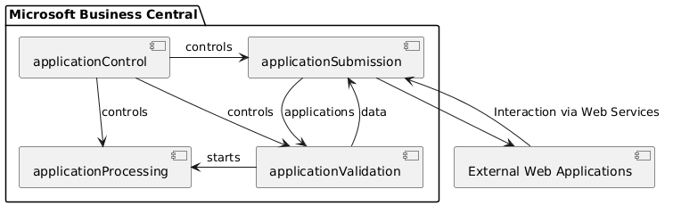
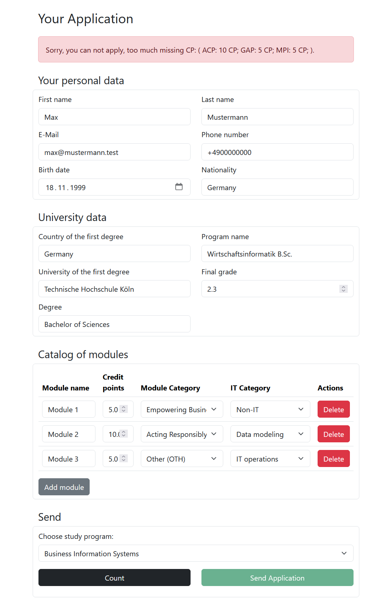
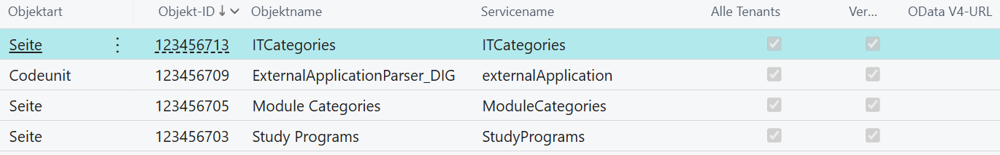
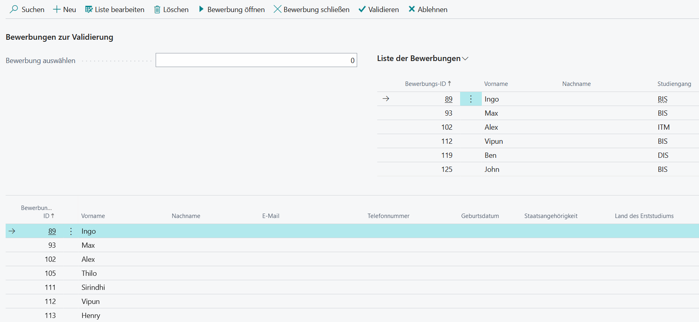
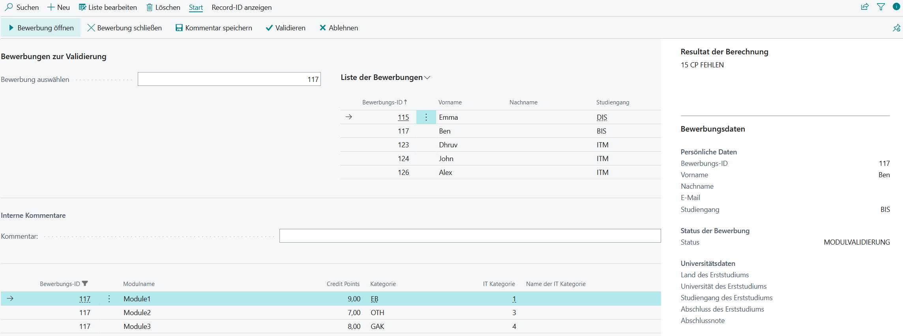

# University Application Platform

This project was developed as part of a Bachelor's thesis. It is an academic working prototype of a platform for handling applications to a Master's programme, based on a real-world university application process. The implementation represents the prototype developed for the thesis.

## Architecture

The repository contains an AL application for Microsoft Dynamics 365 Business Central and a Python web application that exchanges application data with Business Central through web services. Supporting BPMN, component, sequence, and data-model artefacts document the prototype's process and structure.



### Integration in practice

The component diagram above provides the architectural context for the screenshots below. The external Flask application corresponds to the **External Web Applications** component, while `applicationSubmission` forms the integration layer between the web application and Microsoft Dynamics 365 Business Central.

The integration works in two directions:

- **Reference data:** Business Central provides the available study programs, module categories, and IT categories through the `StudyPrograms`, `ModuleCategories`, and `ITCategories` OData V4 services. The web application retrieves this data with `GET` requests and uses it to populate the application form.
- **Application submission:** The web application sends the entered application and module data as JSON to the published `externalApplication` service. Its `countModulesFromJson` action evaluates the entered modules, while `submitApplication` imports the completed application into Business Central.

The resulting flow corresponds to the component model as follows:

`External Web Applications` → `applicationSubmission` → application and module records → `applicationValidation`

> The Business Central extension was developed for a German university. Its pages, field names, and other user-interface elements are therefore shown in German.
> Data in the screenshots has been obscured to avoid accidental matches with real individuals or records, even though the original data was fictional.

#### External web application

<p align="center">
  <a href="screenshots/web.png">
    
  </a>
</p>

The Flask application is the user-facing implementation of the **External Web Applications** component shown in the component diagram. The form combines applicant and university information with reference data retrieved from Business Central, including the available study programs, module categories, and IT categories.

After the applicant has entered the required information, the web application passes the data to the services provided by `applicationSubmission`.

#### Business Central web services

<p align="center">
  <a href="screenshots/bc_webservices.png">
    
  </a>
</p>

These published services implement the interface between Business Central and the external web application:

- `ITCategories` provides the available IT categories.
- `ModuleCategories` provides the available module categories.
- `StudyPrograms` provides the study programs available for external applications.
- `ExternalApplicationParser_DIG`, published as `externalApplication`, receives requests from the web application and processes the submitted JSON data.

Together, these services represent the web-service interaction associated with `applicationSubmission` in the component model.

#### Imported applications

<p align="center">
  <a href="screenshots/bc_applications.png">
    
  </a>
</p>

After a successful submission, the imported applications become available in Business Central. This page shows the application records created from the data received through `applicationSubmission`.

The records are then available to `applicationValidation`, where authorized users can review and validate the submitted applicant information.

#### Imported modules

<p align="center">
  <a href="screenshots/bc_modules.png">
    
  </a>
</p>

The submitted modules are stored as separate records and linked to their application. This `applicationValidation` view allows the imported modules and their validation results to be reviewed together with the corresponding application.

The later `applicationProcessing` stage is intentionally not illustrated because its pages contain internal university data and processes.

## Repository structure

```text
bc/          — Business Central extension
    src/     — AL source code for the Business Central extension
    models/  — UML diagrams and the ERM data model
web/         — Flask web application and HTML templates
model/       — BPMN process model
screenshots/ — Images used in the README
```

## Technologies

- Microsoft Dynamics 365 Business Central and AL
- Python, Flask, and Requests
- HTML, Jinja templates, and Bootstrap
- BPMN, PlantUML, and DBML model files

## Public version

This repository contains the public portfolio version of the Bachelor's thesis prototype. Certain university-specific implementation details, including parts of the academic evaluation logic, have been intentionally omitted. The repository focuses on the technical design and implementation of the prototype rather than documenting the university's internal admissions process.

## Prototype note

This is an academic working prototype and was not designed or security-hardened for production use.

## Usage and copyright

The repository is published primarily so that the project can be reviewed as part of the author's portfolio. It is not presented as an open-source product.
